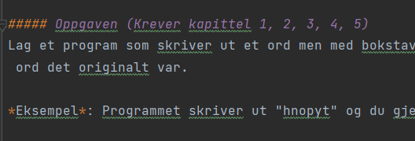

##### Oppgaven (Krever kapittel 1, 2, 3, 4, 5)
Lag et program som skriver ut et ord men med bokstavene i tilfeldig rekkefølge. Deretter skal brukeren prøve å gjette hvilket ord det originalt var.

*Eksempel*: Programmet skriver ut "hnopyt" og du gjetter at ordet er "python".

---

Hint om hvordan du kan blande et ord:
```python
import random

bokstaver = list(ordet) # Gjør ordet om til en liste
random.shuffle(bokstaver) # bland listen
blandet_ord = ''.join(bokstaver) # gjør listen tilbake til et ord
```


